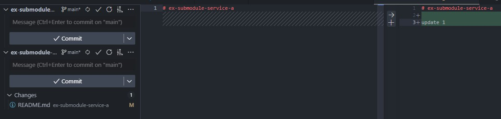

# How to use

สร้าง main repo แบบนี้

```bash
git submodule init
git submodule add git@github.com:dvgamerr/ex-submodule-service-a.git
git add -A
git commit -m "refactor: init submodule"
git submodule status
```

ใน project เห็นแบนี้


ใน source control จะเป็น link ไปอีก proejct แบบนี้


วิธี clone 

```bash
git clone --recursive git@github.com:dvgamerr/ex-submodule.git
# หรือ clone ธรรมดา
git clone git@github.com:dvgamerr/ex-submodule.git
# ก็เข้าไปรัน อีกที
cd ex-submodule
git submodule update --init --recursive
```

เวลา อัพเดต



ใน service a ก็ ทำแบบเดิมได้เลย 
พอ commit service a แล้ว repo หลัก มันจะ ขึ้น change แบบนี้


ก็ commit อีกที แบบนี้ไปได้ เลย


project main commit แค่ ตอนที่ branch main ของทุก service change ก็พอ พี่จะเป็นคน commit ก็ได้
ส่วนน้องๆ ก็ให้ commit แค่  service ไป 

## Ref
- https://git-scm.com/docs/git-submodule
- https://github.com/dvgamerr/ex-submodule
- https://github.com/dvgamerr/ex-submodule-service-a
